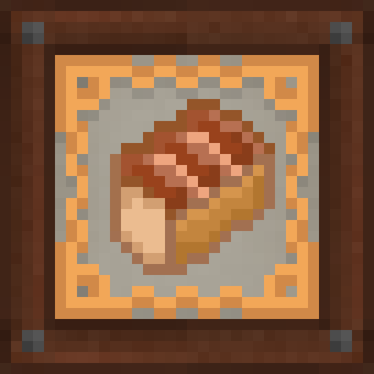

# Gastronomy Works

A small addon to Immersive Engineering which adds a variety of food items.
All foods added rely on industrial processing to make them, primarily using the mixer and bottling machine.

Among the added foods are various baked goods (baguette, sour dough, cake) but also canned goods like stew!

## Downloads
[Modrinth](https://modrinth.com/project/gastronomy-works)

[CurseForge](https://www.curseforge.com/minecraft/mc-mods/gastronomy-works)
